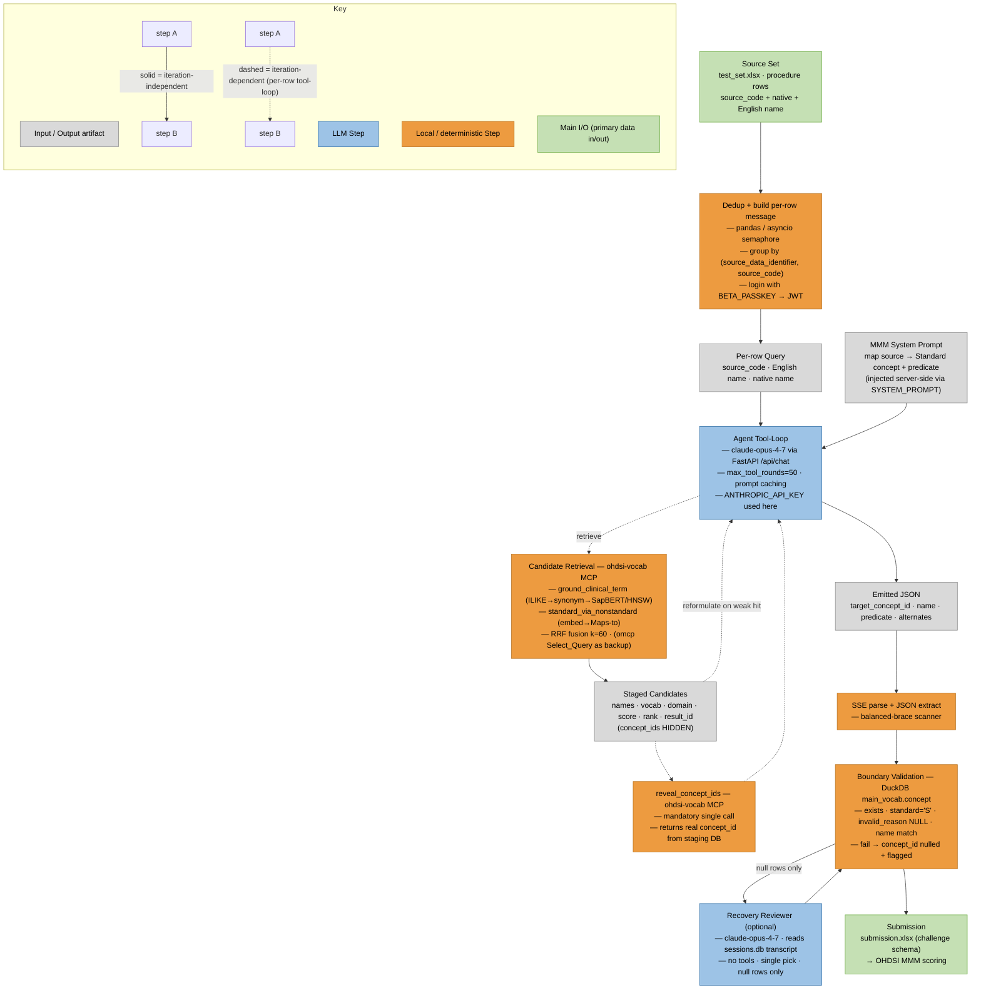

# Request lifecycle — how one input row becomes one output row

This traces the **complete soup-to-nuts path** of the MMM vocabulary-mapping pipeline: from an input spreadsheet, through the deterministic code that splits it into **one isolated LLM request per source row**, to a single validated row of output. Every step is labelled as deterministic (local) or model-driven (LLM); only **one** step in the whole flow is non-deterministic.

The driver is [`mmm_pipeline/scripts/mmm_pipeline_api.py`](../scripts/mmm_pipeline_api.py); the per-row prompt is [`system_prompt.py`](../scripts/system_prompt.py); the model runs server-side in [`webapp/backend/agent.py`](../../webapp/backend/agent.py).

## Diagram convention (Jared Houghtaling's OHDSI agentic-flow idiom)

Node colors: **Input/Output** (grey) · **LLM Step** (blue) · **Local / deterministic Step** (orange) · **Main I/O** (green, primary data in/out). Edges: **solid** = *iteration-independent* (runs once per row) · **dashed** = *iteration-dependent* (inside the per-row agent tool-loop, the system's only iteration).

## Two keys (don't confuse them)

- **`BETA_PASSKEY`** — gates the webapp. The driver logs in with it (`POST /api/auth/login`) and gets a short-lived JWT, sent as a `Bearer` token on every `/api/chat` call. A local gate, not an account.
- **`ANTHROPIC_API_KEY`** — used **server-side** by the webapp's `ClaudeProvider` to call the model. The driver never sees it.

---

## Worked example (one row)

Input row (illustrative — *not* a real challenge row):

| source_data_identifier | source_code | original_source_name | source_name |
|---|---|---|---|
| 7 | RX1234 | (native-language text) | "chest x-ray, two views" |

becomes, after the full flow, one output row:

| target_concept_id | target_concept_name | predicate | … |
|---|---|---|---|
| 4087381 | "Plain chest X-ray" | broadMatch | (+ provenance: tools_called, rounds, session_id, validation_error=NULL) |

A row can also become **N** output rows when the source genuinely needs multiple Standard concepts (e.g. a multi-drug regimen) — see step 6.

---

## Step by step

> Per-step tags: **[Main I/O]** primary data in/out · **[Local]** deterministic local step · **[LLM]** model step · `(indep)` iteration-independent · `(dep)` iteration-dependent.

1. **[Main I/O] (indep) — Load source set.** Read `test_set.xlsx` (sheet `in`) with pandas: `source_data_identifier`, `source_code`, `original_source_name` (native language), `source_name` (English). *(`mmm_pipeline_api.py: main`)*
2. **[Local] (indep) — Deduplicate.** `drop_duplicates(["source_data_identifier","source_code"], keep="first")` so each distinct source is mapped exactly once.
3. **[Local] (indep) — Authenticate.** Async httpx client logs into the webapp with `BETA_PASSKEY` → JWT. *(`login`)*
4. **[Local] (indep) — Fan out to single-row requests.** An `asyncio.Semaphore(--concurrency)` bounds parallelism; the driver issues **one** `POST /api/chat` (SSE) per unique row. *(`process_source`)*
5. **[Local] (indep) — Build the per-row message.** `build_user_message(row)` packages source_code + English name + native name (if different) into the user turn; the MMM system prompt is injected server-side via `SYSTEM_PROMPT`. *(`system_prompt.build_user_message`)*
6. **[LLM] (dep) — Server-side agent tool-loop.** The one non-deterministic step (`webapp/backend/agent.py`, `max_tool_rounds=50`). The model, adaptively:
   - **retrieves candidates** via `ground_clinical_term` and/or `standard_via_nonstandard` on the **ohdsi-vocab** MCP server (SapBERT + HNSW, fused by RRF k=60);
   - **reformulates** on weak hits (strip administrative suffixes, expand acronyms, try the native name); *(dep — depends on the previous round)*
   - **reveals the id** — a mandatory `reveal_concept_ids(result_id)` call (retrievers return names/score/rank/`result_id` only; concept_ids stay hidden in a staging DB so they can't be hallucinated);
   - optionally runs `Select_Query` on the **omcp** server for an edge-case vocab lookup;
   - **emits final JSON** — a single object, or an array for genuine 1:many.
7. **[Local] (dep) — Parse the stream.** Collect the SSE events (`text`, `tool_call`, `tool_result`, `session`, `done`) into an `AgentRun`; **extract JSON** with a balanced-brace scanner that tolerates braces inside the `reasoning` field. *(`call_agent`, `extract_json`)*
8. **[Local] (indep) — Normalize picks.** One object → 1 pick; an array → N picks (`pick_index`, `n_targets`). Each pick becomes one output row. *(`process_source`)*
9. **[Local] (indep) — Boundary validation (the hallucination backstop).** For each pick, `validate_against_vocab()` opens the OMOP vocabulary DuckDB **read-only** and requires the emitted `concept_id` to: (a) exist, (b) be `standard_concept='S'`, (c) have `invalid_reason IS NULL`, (d) match the name the model claimed. Any failure → `target_concept_id` nulled + `validation_error` set. *(`validate_against_vocab`)*
10. **[LLM] (dep, optional) — Recovery.** `mmm_recovery.py` (optional) re-prompts an Opus "reviewer" for rows that ended null but have a `session_id`, reading the untruncated transcript from `sessions.db`; result is re-validated. (Under Docker the session DB lives inside the `webapp` container — see the runbook.)
11. **[Main I/O] (indep) — Format & submit.** `submission_formatter.py --strict` joins predictions back onto the test rows by `(source_data_identifier, source_code)`, fills authoritative names from the vocabulary, and writes the challenge-schema `submission.xlsx`. (`score_vs_truth.py` scores train runs.)

**Output row schema:** `source_data_identifier, source_code, original_source_name, source_name, target_concept_id, target_concept_name, alternative_target_concept_id, alternative_target_concept_name, predicate`.

**Determinism:** steps 1–5 and 7–11 are fully deterministic; only step 6 (the model's tool-loop) varies, and step 9 is a deterministic gate that drops anything the model gets wrong about the vocabulary.

---

## Pipeline diagram

The **dashed region is the agent tool-loop** (retrieve → reformulate → reveal) — the only iteration in the system. There is **no cross-row outer loop**: each row is mapped in complete isolation, and a deterministic validation gate (not a metrics feedback loop) stands between the model's output and the submission.

---

## Code map

| Step | Where |
|---|---|
| load / dedup / fan-out / orchestration | `mmm_pipeline/scripts/mmm_pipeline_api.py` (`main`, `process_source`) |
| per-row prompt | `mmm_pipeline/scripts/system_prompt.py` (`build_user_message`, `SYSTEM_PROMPT`) |
| auth + SSE call | `mmm_pipeline_api.py` (`login`, `call_agent`) |
| JSON extraction | `mmm_pipeline_api.py` (`extract_json`) |
| boundary validation | `mmm_pipeline_api.py` (`validate_against_vocab`) |
| server-side tool-loop | `webapp/backend/agent.py` (`agent_loop`), `webapp/backend/mcp_client.py` |
| retrieval / grounding tools | `mcp_server/tools/` + `omop_vocab_core/` |
| optional recovery | `mmm_pipeline/scripts/mmm_recovery.py` |
| format / score | `mmm_pipeline/scripts/submission_formatter.py`, `score_vs_truth.py` |
